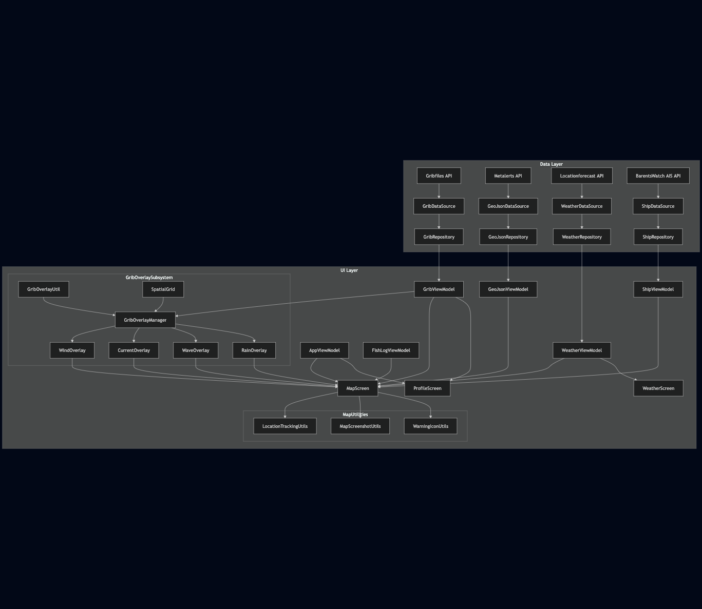

# Arkitektur - Sjøspor

## Innledning
Dette dokumentet beskriver arkitekturen til Sjøspor, en Android-applikasjon utviklet for fiskere. Dokumentet er primært rettet mot utviklere som skal videreutvikle appen og sette seg inn i kodestrukturen.

### Android Versjon
- **Minimum SDK**: 31 (Android 12)
- **Target SDK**: 35 (Android 14)
- **Compile SDK**: 35

Valget av minimum SDK 31 gir oss tilgang til moderne Android-funksjoner samtidig som vi dekker en stor andel av aktive Android-enheter. Target SDK 35 sikrer at vi følger de nyeste Android-retningslinjene og har tilgang til de nyeste API-ene.

### Hovedteknologier
- **Kotlin**: Primært programmeringsspråk
- **Jetpack Compose**: UI-rammeverk
- **Material3**: Designsystem
- **MapLibre GL**: Kartløsning
- **OkHttp**: Nettverkskommunikasjon
- **Coil**: Bildehåndtering
- **Location Services**: Lokasjonstjenester
- **FileProvider**: Filhåndtering for bilder

## Arkitektur og Design

### Lav kobling 
| Del av systemet | Positivt                                                                                  | Svakheter                                                                                                                               |
|-----------------|-------------------------------------------------------------------------------------------|-----------------------------------------------------------------------------------------------------------------------------------------|
| Repositories → ViewModels | Repositories er separate klasser som skjuler nettlogikk; ViewModel henter data via disse. | De instantieres ofte manuelt i Screen-kode → presentasjonslaget må kjenne til repo-implementasjon og Context.                           |
| Utils (f.eks. GribOverlayUtil, LocationTrackingUtils) | Inneholder ren logikk for beregning.                                                      | Mange utils har sideeffekter; det gir en sterk kobling mot Android-API og MapLibre.                                                     |
| Overlays | Egen underpakke (ui/grib/overlays) som kapsler visuell GRIB-representasjon.               | Implementert som singletons som endrer MapLibre Style direkte → dette har ført til tett kobling til kartbibliotek og til global tilstand. |

### Høy kohesjon
Flertallet av utils og overlay-klasser har ett primært ansvar (f.eks. WaveOverlay tegner bare bølger).
AppViewModel bryter kohesjon: den eier navigasjon, brukerprofil, filterinnstillinger, mørk/lys modus osv.

### MVVM i praksis
| Komponent   | Implementasjon                                                                   | Avvik                                                                                                                    |
|-------------|----------------------------------------------------------------------------------|--------------------------------------------------------------------------------------------------------------------------|
| Model       | Repository + DataSource-struktur for hvert domene (Weather, Grib, Ship, Alerts). |                                                                                                                          |
| ViewModel   | Eksponerer StateFlow som observeres i Compose-skjermer                           | Instansieres oftest inne i Screen, med remember { … } (uten ViewModel)                                                   |
| View | Observerer tilstand og kaller VM-metoder.                                        | Mange skjerm-filer oppretter nettverks- eller repos-instanser selv → Mye kunnskap fra modell lekker derfor til UI-laget. |

### UDF (Unidirectional Data Flow)
**Brudd**
- GribOverlayManager og andre utils muterer kartet direkte, så mye av dataflyten går utenom VM.
- Enkelte utils gir dataflyt til UI-lag uten VM-mellomledd. 

### Testbarhet og Videreutvikling
- Fravær av DI (Dependency Injection) gjør enhetstesting av ViewModel vanskelig; må opprette repo/Context.
- Singletons og direkte Context gjør at alle deler på samme data og samme Android-objekter. Da blir det vanskelig å kjøre tester samtidig og uavhengig av hverandre.
- Splitte for eksempel AppViewModel og flytt mye av overlay-beregning til egen ViewModel for å muliggjøre ren enhetstesting av kartlogikk.

### Forbedringsforslag
1. **Dependency Injection**
   - Bruke et avhengighetsverktøy som Hilt for å "dele ut" Repository-objektene til ViewModel-ene.
   - Da vil skjermene slippe å lage dem selv, og vi kan bytte dem ut med test-versjoner når vi tester.
2. **ViewModel-er**
   - Dele opp for eksempel AppViewModel og gi hver del ett tydeligere ansvar.
3. **Gjør GRIB-tegningen renere**
   - Istedenfor å la GribOverlayManager endre kartet direkte, la GribViewModel først lage en liste med "overlay-data".

### Oppsummering
Løsningen bruker MVVM og UDF-prinsippene som et rammeverk, men implementasjonen er ikke konsekvent, med:
- Tett kobling til Android- og MapLibre-API-er.
- Vi har noen «gud-objekter» og singletons som reduserer kohesjon og øker kompleksitet.

Dersom det innføres strengere grenser for modulene og ViewModel-oppdeling kan prosjektet oppnå lavere kobling, høyere kohesjon og bedre testbarhet. Det vil øke kvaliteten og levetiden til koden.

### Hemmelige nøkler 

**Dagens løsning**
'clientId' og 'clientSecret' ligger som ren tekst i 'ShipDataSource.kt'. Dette gjør dem synlige i Git-historikken, som ikke er optimalt. 
Dette er allikevel et aktivt valg, ettersom bruker selv (inkld sensor) hadde vært nødt til å lage egen ID og passord for å få tilgang til skipene. 

**Bedre løsning**
Flytt nøklene til 'gradle.properties' (som ikke commit-es) og eksponerer dem via 'BuildConfig.BAR_ID' / 'BuildConfig.BAR_SECRET'
Da blir de ikke sjekket inn i repoet og kan enkelt byttes per bygg-variant. 

### Byggeprosess
1. Klon repositoriet
2. Åpne prosjektet i Android Studio
3. La Gradle synkronisere avhengigheter
4. Bygg prosjektet med `./gradlew build`

