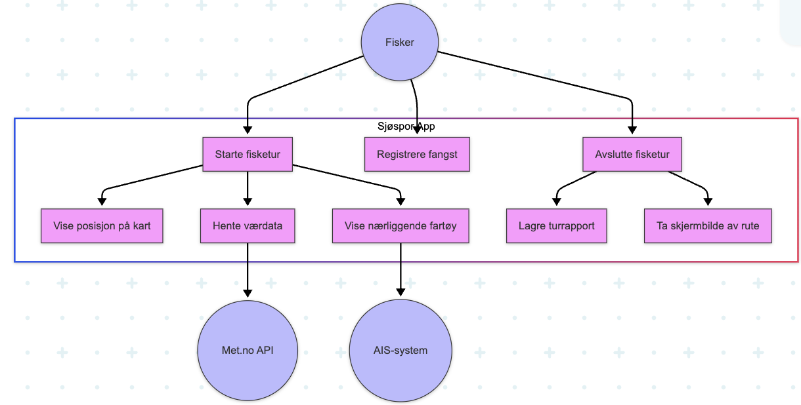
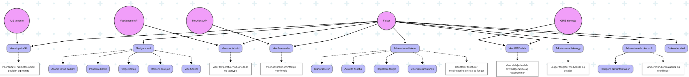
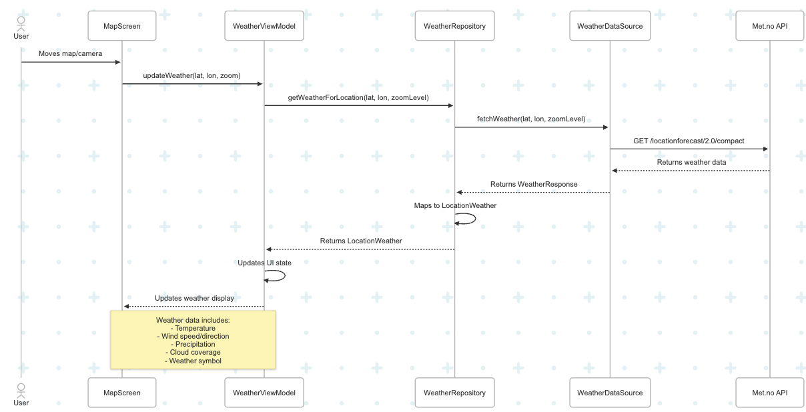
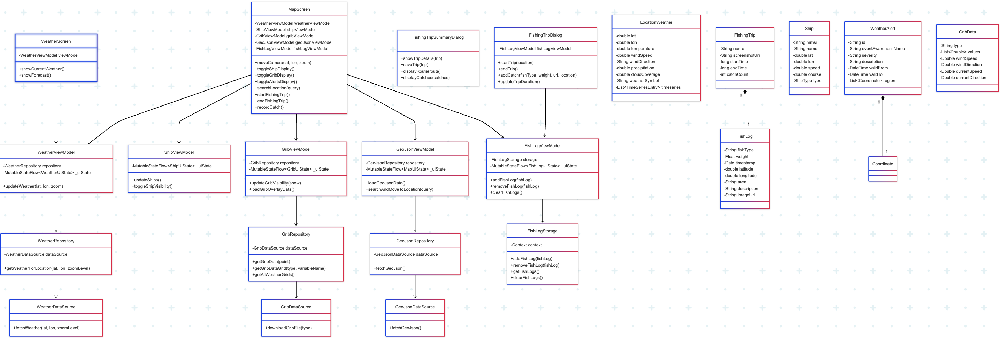
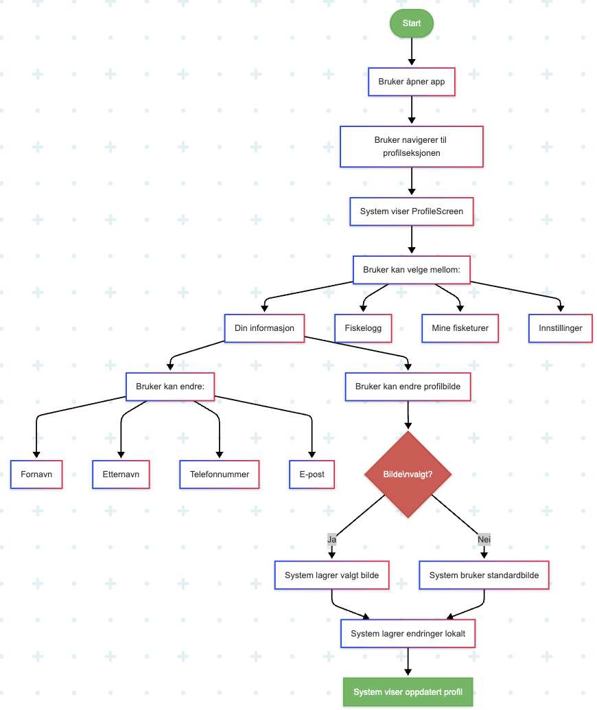

# Modellering - Sjøspor

Dette dokumentet beskriver de viktigste funksjonelle kravene og systemdesignet for Sjøspor. Her finner du use case-beskrivelser, diagrammer og forklaringer som gir innsikt i hvordan appen fungerer og er strukturert.

---

## 1. Use case: Starte fisketur

**Aktører:**
- Primær: Fisker
- Sekundære: Værtjeneste (API), AIS-system (båtposisjon)

**Forutsetninger:**
- Brukeren har lastet ned appen
- Brukeren har tillatt posisjonstilgang
- Appen har internett-tilgang

**Normal flyt:**
1. Brukeren åpner appen
2. Navigerer til "Start fisketur"
3. Systemet sporer brukerens posisjon
4. Systemet viser relevant informasjon for brukeren på turen
5. Brukeren registrerer fangst
6. Systemet lagrer informasjon om fangst
7. Brukeren avslutter fisketur

**Alternativ flyt:**
- Etter punkt 3 mister brukeren internett-tilgang
- Systemet varsler om at API og kartdata ikke kan lastes inn
- Brukeren fortsetter fisketuren med begrensede funksjoner (kan fortsatt lagre fangst)
- Brukeren avslutter fisketuren, men mangler noe informasjon grunnet manglende data

**Resultat:**
- Aktiv fisketur er startet
- Brukerens posisjon og bevegelser spores og vises på kartet
- Relevante værdata og skipsposisjoner vises (hvis tilgjengelig)
- Brukeren kan registrere fangst under turen
- Når turen er ferdig, genereres en turrapport

**Beskrivelse:**
Dette use case-diagrammet viser hvordan en fisker starter en fisketur i appen. Systemet sporer posisjon, henter vær- og skipsdata, og lar brukeren registrere fangst. Hvis internett forsvinner, får brukeren begrenset funksjonalitet, men kan fortsatt lagre fangst. Når turen avsluttes, genereres en rapport.

---

## 2. Use case: Registrere fangst

**Aktører:**
- Primær: Fisker
- Sekundære: Ingen

**Forutsetninger:**
- Brukeren har lastet ned appen
- Brukeren har en aktiv fisketur i gang
- Brukeren har tillatt tilgang til kamera
- Appen har tilgang til GPS-posisjon

**Normal flyt:**
1. Brukeren navigerer til fangstregistrering under aktiv fisketur
2. Systemet åpner fangstregistreringsskjerm
3. Systemet henter brukerens nåværende posisjon
4. Brukeren velger fisketype fra en liste
5. Brukeren legger inn vekt og beskrivelse
6. Brukeren tar bilde av fangsten
7. Systemet lagrer fangstinformasjonen og bildet
8. Systemet oppdaterer kartet med fangstposisjon

**Alternativ flyt:**
- Etter punkt 5 velger brukeren å hoppe over bildetaking
- Systemet fortsetter uten bilde
- Systemet lagrer fangstinformasjonen uten bilde
- Systemet oppdaterer kartet med fangstposisjon

**Resultat:**
- En fangst er registrert i systemet
- Fangsten er knyttet til den aktive fisketuren
- Fangsten er markert på kartet
- Fangstdetaljer er lagret (fisketype, vekt, beskrivelse, og eventuelt bilde)
- Fangsten vil inkluderes i turrapporten som genereres når turen avsluttes

## 3. Use case: Kart-navigasjon

**Beskrivelse:**
Dette use case-diagrammet viser hvordan brukeren kan navigere mellom ulike deler av appen via kartet. Brukeren kan se værdata, skipsposisjoner, og egne fangster på kartet, samt filtrere og utforske ulike lag.

**Beskrivelse:**
Brukeren kan navigere mellom kartlag, se vær, skip og egne fangster, og filtrere informasjon. Diagrammet illustrerer hovedflyten og alternative navigasjonsmuligheter i appen.

---

## 4. Sekvensdiagram: Bruk av vær-funksjonen

**Beskrivelse:**
Sekvensdiagrammet illustrerer hvordan brukeren henter værdata for et valgt område. Brukeren trykker på "Vis vær", appen sender forespørsel til vær-API, og resultatet vises i grensesnittet. Diagrammet viser samspillet mellom bruker, UI, ViewModel og Repository/DataSource.

---

## 5. Klassediagram

**Beskrivelse:**
Klassediagrammet gir en visuell oversikt over de viktigste klassene og deres ansvar, samt hvordan de samarbeider for å realisere funksjonaliteten i Sjøspor. Det reflekterer use-case og sekvensdiagrammene, og viser hvordan ViewModels, Repositories, DataSources og domeneobjekter henger sammen.

---

## 6. Flytdiagram: Lage profil

**Beskrivelse:**
Flytdiagrammet viser steg-for-steg hvordan brukerens profil håndteres i appen, inkludert opprettelse, validering av input og lagring av endringer. Diagrammet illustrerer beslutningspunkter og mulige utfall i profillogikken.

