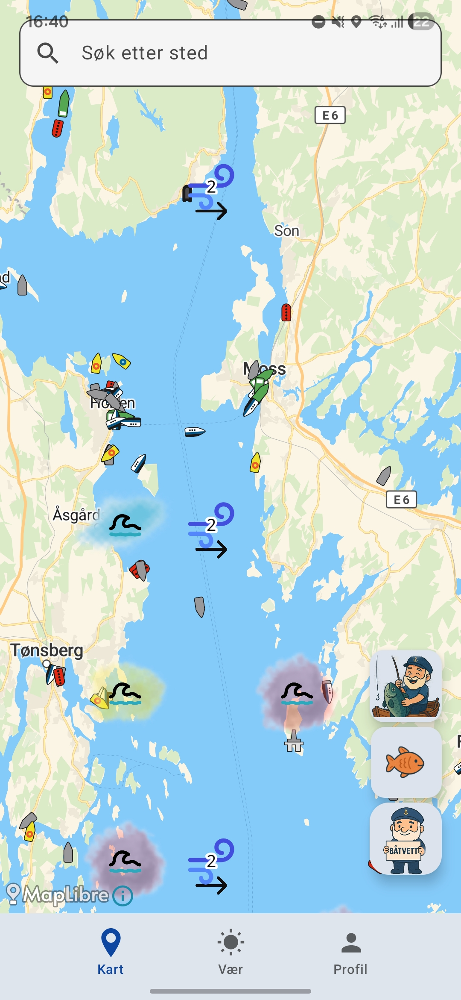
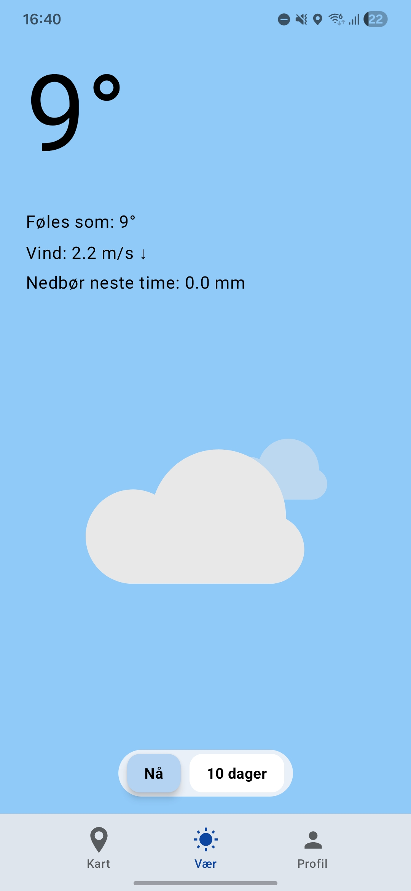
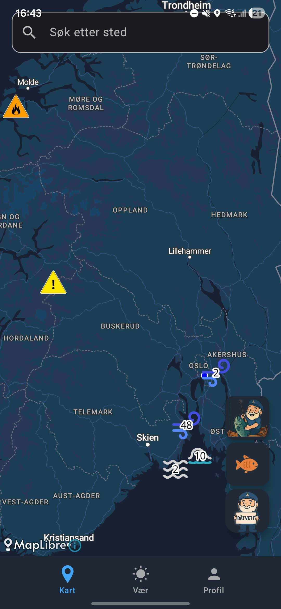
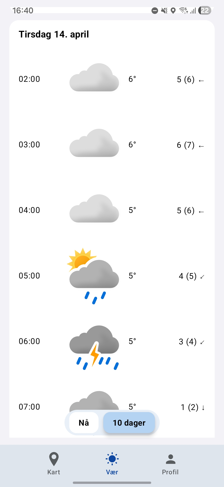

# Sjøspor App

Android application developed in Kotlin that visualizes complex weather and ocean data using GRIB format from the Norwegian Meteorological Institute API.

## Screenshots

| Map | Weather |
|-----|--------|
|  |  |
|  |  |
## Key Features
- Visualization of wave height, wind and ocean conditions
- Real-time ship positioning
- Custom warning thresholds for dangerous conditions
- Interactive map with multiple data layers

## Tech Stack
- Kotlin + Android Studio
- Jetpack Compose (UI)
- MapLibre / OSM (maps)
- OkHttp + JSON (networking)
- GRIB parsing (NetCDF)

## About the Project
Developed as part of a university group project (IN2000) at the University of Oslo.  
Focused on handling complex data formats (GRIB) and building a full Android application from scratch in a team environment.

## Detailed Documentation
- En Android-applikasjon utviklet for fiskere som gir tilgang til værdata, skipsposisjoner, og mulighet for å starte fisketurer og logge fangster.

## CASE-KRAV
- Case 2 kravlegger: "Nedbør og bølgehøyde er skalarverdier som kan vises med farger, mens vind og strøm er vektorer hvor dere må tegne piler eller på andre måter angi både retning og styrke. Dersom noen av verdiene overstiger en viss terskel (satt av bruker) skal dette markeres i kartet så man kan unngå å ferdes i området."

- Terskler for GRIB-dataen finnes via profil > innstillinger. 

## README.md Struktur

- Vi følger GitHub sitt anbefalte rammeverk. 

## Krav til systemet 

- Android 12 (API level 31)
- Internettilkobling
- GPS/lokasjonstjenester
- Kamera (valgfritt, for å ta bilder av fangster)

## Funksjoner

- Værdata, farevarsler og prognoser for fiskere
- Skipsposisjoner i sanntid
- Fiskelogg for å registrere fangster
- Dark og light mode toggle > profil > innstillinger 
- Profilside med personlig informasjon
- Kart med ulike lag (vær, skip, farevarsler)
- Fisketur, bruker kan starte fisketur gjennom knapp på hovedskjermen

## Brukte biblioteker

### Kart og lokasjon
- **MapLibre GL**: Brukes for å vise interaktive kart med ulike lag
- **OSMDroid**: Alternativ kartløsning
- **Google Play Services Location**: For å håndtere lokasjonstjenester

### UI og design
- **Jetpack Compose**: Moderne UI-rammeverk for Android
- **Material3**: Designsystem for moderne Android-apps
- **Lottie**: For animasjoner og GIF-støtte
- **Coil**: For bildehåndtering og caching

### Data og nettverk
- **OkHttp3**: For nettverkskommunikasjon
- **NetCDF/GRIB**: For å parse værdata og prognoser
- **JSON**: For datahåndtering

### Andre viktige biblioteker
- **ThreeTenABP**: For håndtering av datoer og tidssoner
- **Lifecycle Components**: For å håndtere app-tilstand og livssyklus

## Utviklere

1. Adrian Andersen Svindahl – adriansv@uio.no
2. Thrisanth Thambirajah – thrisant@uio.no
3. Aayan Ali – aayana@uio.no
4. Carl Orrall - carlorr@uio.no
5. Hedda Hinderlind Misje – heddahmi@uio.no 
6. Simen Brunvatne – simebru@uio.no 

